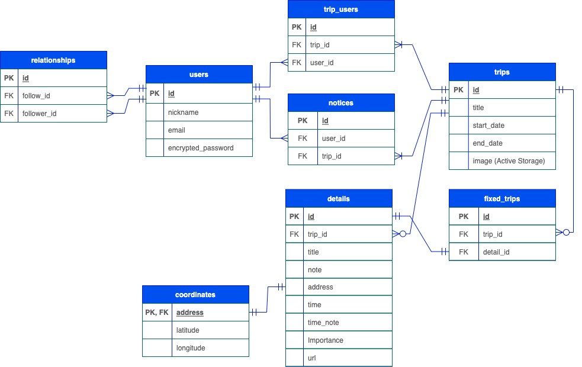

# アプリケーションについて

## アプリケーション概要
ひと言で表すと旅行のナビゲーション（計画から道案内まで）アプリです。
友人や家族と旅行の計画を共有したり、一人旅でもスケジュールを立てて旅行の管理ができます。また、旅行先の天気予報や地図情報が取得できます。
 

### アプリ URL : <a href="https://tabinavi46.com" target="_blank" rel="noopener noreferrer">**tabinavi46.com**</a>
（別タブリンクの設定ができず、お手数をおかけし申し訳ありませんが 別タブで開く際は**右クリック**にてお願いします）

### テストアカウント
* ID：**tabi@tabi**
* Password：**tabi123**
 

アプリ説明資料（Googleドキュメント） : <a href="https://docs.google.com/document/d/1z85d3zdV6kbzSs2TPphY0B2Ft1DCbSUWojogwXXsyWs/edit?usp=sharing" target="_blank" rel="noopener noreferrer">こちら</a> （工夫した点などを記載しています）
 
（別タブリンクの設定ができず、お手数をおかけし申し訳ありませんが 別タブで開く際は**右クリック**にてお願いします）
 

## 作成背景
* 約2ヶ月スクールでプログラミングを学習し、その学びのアウトプットや更なる技術習得のために作成しました。 
* また、友人や家族との旅行で宿泊先や観光場所などを決めたあとその情報をまとめておく場所がなく、時間が経ってから宿泊先などの情報を探すことが面倒なため、スケジュールを共有して管理できる旅行ナビゲーションアプリを選びました。
 

## ユーザーイメージ
* 旅行の計画を管理したい人
* 友人や家族と旅行の計画を一緒に決める人
* 友人や家族と旅行の計画を一緒に決めたいけれど任せっきりにしている人
* 旅行のスケジュールを後から振り返りたい人
 

## 機能一覧
 * ユーザー登録
 * フレンド機能 (旅行の同伴者として選択できる)
 * 旅行計画作成
 * 詳細スケジュール作成
 * 天気予報取得
 * ルート検索・マップ表示
 * 現在地の周辺スポット検索・マップ表示
 * 通知機能 (同伴者による編集等)
   

# 開発について

## 開発技術・利用ツール
* Ruby (2.6.5)
* Ruby on Rails (6.0.0)
* JavaScript
  * Geolocation API
  * Open Weather API (Fetch API)
  * Google APIs
    * Directions API
    * Geocoding API
    * Maps JavaScript API
    * Places API
* MySQL
* Git/GitHub
* Visual Studio Code
* AWS (下記インフラに詳細記述)
 

## 主なGem（ライブラリ）
* devise (ユーザー管理機能)
* kaminari (ページネーション機能)
* gon (JavaScriptへのデータ受け渡し)
* rspec-rails (テストコード)
* factory_bot_rails (テストデータ作成の効率化)
* faker (ランダムデータ作成)
* rubocop (静的コード解析, コードチェック)
* capistrano (自動デプロイ)
* unicorn (アプリケーションサーバー)
* aws-sdk-s3 (AWS, S3)
 

## ER図

 

## 利用インフラ
* AWS
  * EC2
  * S3
  * Route 53
  * Certificate Manager
* Nginx
* Unicorn
